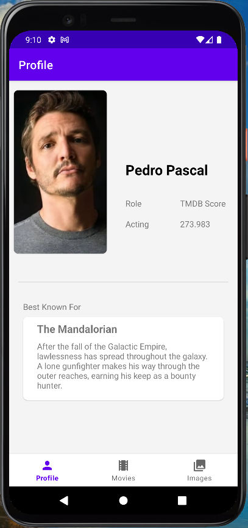
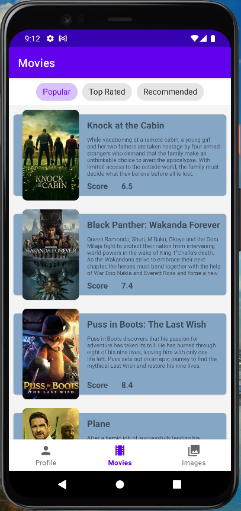
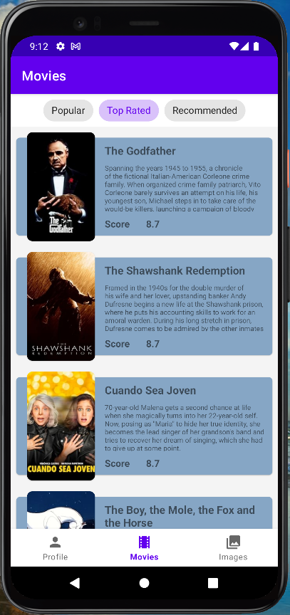
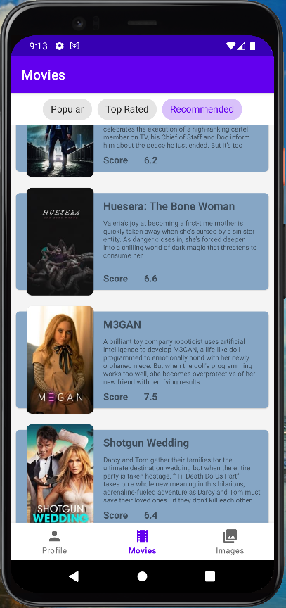
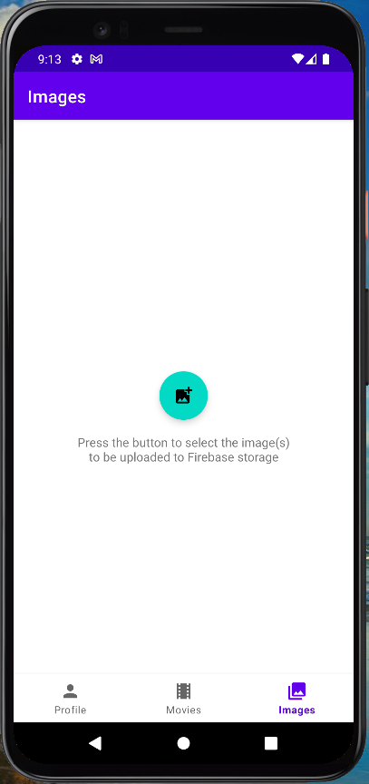
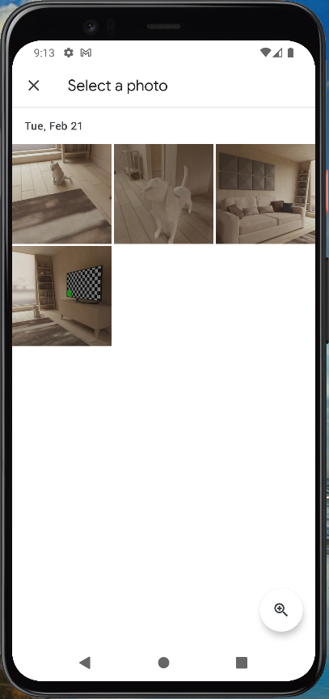
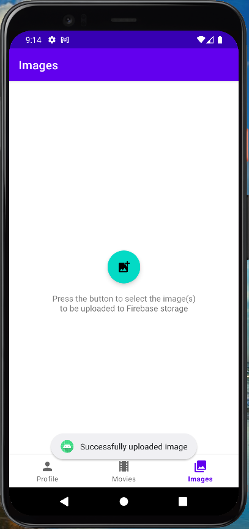
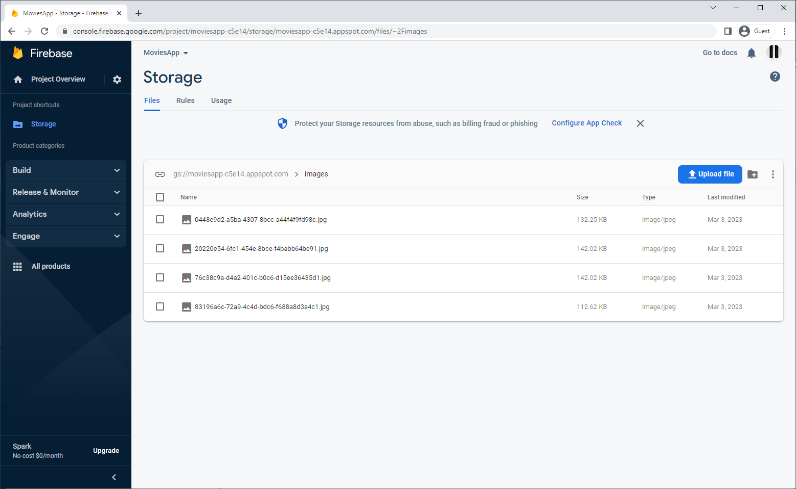
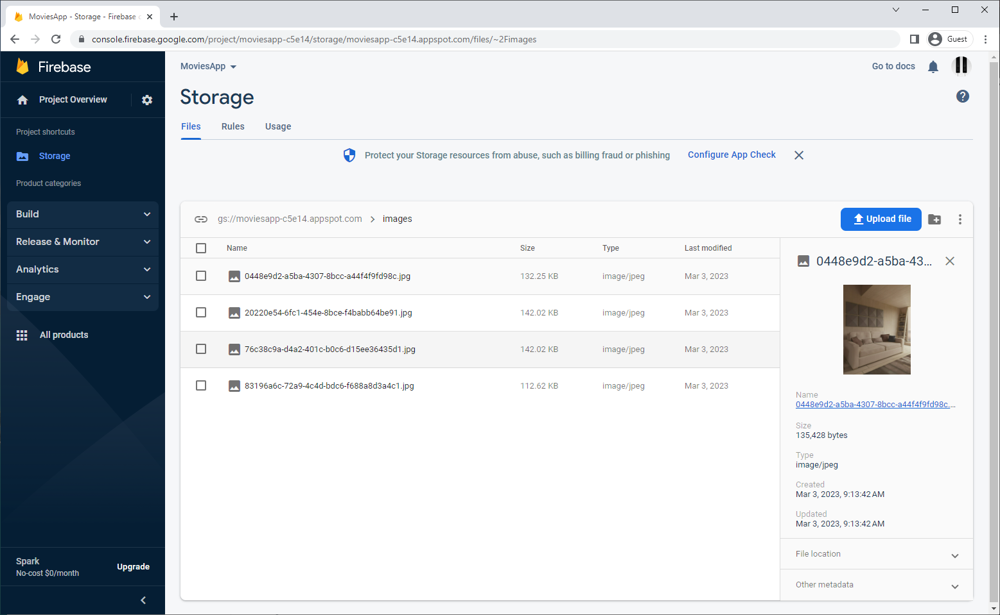
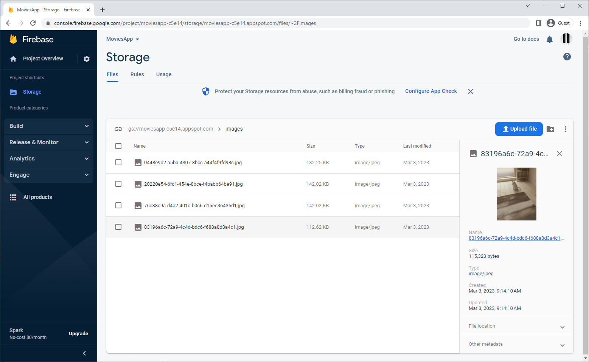

## Movies App

**General Description**

* This application retrieves information using TheMovieDataBase TMDB api to show different data sets
  including a profile retrieval and multiple movie lists to be shown in an intuitive and user friendly structure.
* Additionally, it includes a feature to upload an image picked from the phone's gallery to the
  Firebase Storage remote cloud service.

**Libraries integrated**

1. HILT - Used to add dependency injections to the project.
2. Retrofit - Used to perform asynchronous calls to a remote service API.
3. Glide - Used to load images into the UI safely.
4. Firebase Storage - Used to upload and store files, in this case images, to the remote cloud storage.
5. Room - Used for local persistence of data.
6. Material - Used for a rich, intuitive and user friendly UI elements.
7. Kotlin Flow - Used to integrate coroutine-based asynchronous requests and operations.
8. Kotlin Coroutines - Used to integrate asynchronous code and tasks for a seamless interaction.

**Architecture**
This app was programmed under the rules and practices of MVVM, Clean code architecture,
SOLID principles, Repository pattern, Dependency Injection.

**Data Flow**

* Profile feature - A call to the PopularPerson TMDB api is made using retrofit to retrieve an
  actor's profile information to be displayed to the user.
* Movies List feature - Similarly, three calls are made to the TMDB api to retrieve popular,
  top rated and recommended movies to be displayed in recyclerview lists in an intuitive fashion.
* Image upload - The user is able to choose an image from the phone's gallery and upload it to
  firebase storage.

**Evidence**

| Feature              | Evidence                                    |
|----------------------|---------------------------------------------|
| Profile Feature      |        |
| Movies List Feature  |    |
| Movies List Feature  |    |
| Movies List Feature  |    |
| Image upload Feature |    |
| Image upload Feature |    |
| Image upload Feature |    |
| Firebase Console     |    |
| Firebase Console     |    |
| Firebase Console     |  |

=======================================

### App Version Reference

* version 1         1.0 - MAR 02 2023
